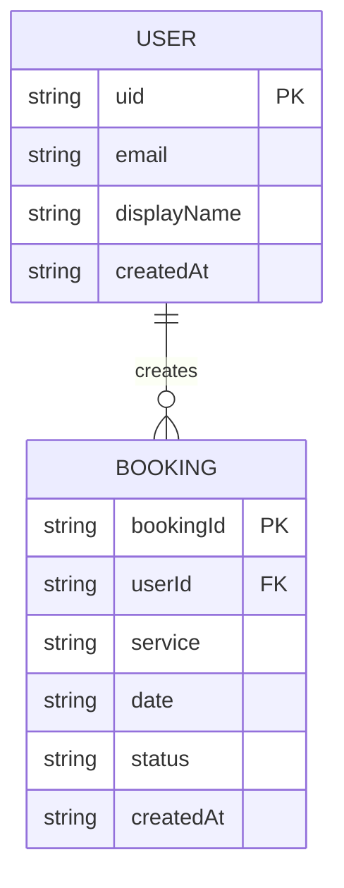
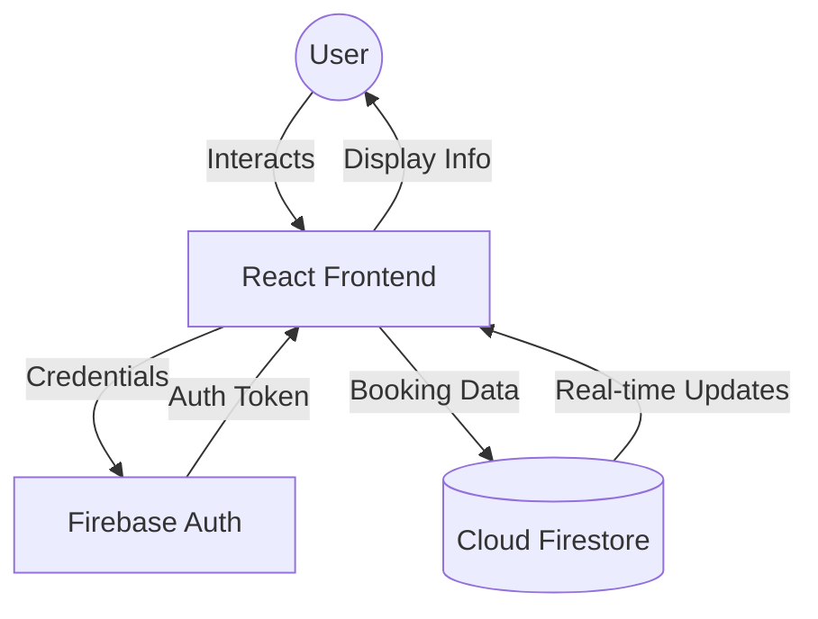

# Aqua Blast - The Surface Experts

Aqua Blast is a professional pressure washing service application built with a modern full-stack architecture. It provides users with the ability to learn about services, book restoration appointments, and manage their bookings in real-time.

---

## 🏗️ Architecture

The application follows a **Full-Stack SPA (Single Page Application)** architecture with a serverless backend integration.

- **Frontend**: 
  - **React 18** with **Vite** for fast development and optimized builds.
  - **Tailwind CSS** for utility-first styling.
  - **Motion (Framer Motion)** for smooth animations and transitions.
  - **Lucide React** for consistent iconography.
- **Backend**:
  - **Express.js** server running on Node.js to serve the application and handle routing.
- **Database & Authentication**:
  - **Firebase Authentication**: Handles secure user sign-up, login (Email/Password & Google), and session management.
  - **Cloud Firestore**: A NoSQL document database providing real-time data synchronization via `onSnapshot` listeners.
- **Security**:
  - **Firestore Security Rules**: Implements granular access control to ensure users can only access their own data.
  - **Error Boundary**: Custom React Error Boundary to catch and report database permission issues.

---

## 🌐 Website Schema (Sitemap)

The application structure is organized into the following routes:

- **Home (`/`)**: Hero section, value proposition, and featured services.
- **About (`/about`)**: Company philosophy, team information, and performance statistics.
- **Services (`/services`)**: Detailed breakdown of Residential, Commercial, and Industrial services.
- **Contact (`/contact`)**: Interactive booking form for scheduling services.
- **Auth (`/auth`)**: Unified Login and Sign-up portal with Google integration.
- **Dashboard (`/dashboard`)**: Private user area to view and manage active/past bookings.

---

## 📊 Database Schema (Firestore)

The database is structured into two primary collections:

### 1. `users` Collection
Stores profile information for authenticated users.
- **Path**: `/users/{userId}`
- **Entity**: `User`

### 2. `bookings` Collection
Stores service requests made by users.
- **Path**: `/bookings/{bookingId}`
- **Entity**: `Booking`

---

## 📖 Data Dictionary

### Entity: User
| Field | Type | Format | Description |
|-------|------|--------|-------------|
| `uid` | String | - | Unique identifier from Firebase Auth |
| `email` | String | Email | User's registered email address |
| `displayName`| String | - | User's full name or nickname |
| `createdAt` | String | ISO 8601 | Timestamp of account creation |

### Entity: Booking
| Field | Type | Format | Description |
|-------|------|--------|-------------|
| `userId` | String | - | Reference to the User who created the booking |
| `service` | String | - | Type of service requested (e.g., Residential) |
| `date` | String | Date | Scheduled date for the service |
| `message` | String | - | Additional notes or instructions |
| `status` | String | Enum | `pending`, `confirmed`, `cancelled` |
| `createdAt` | String | ISO 8601 | Timestamp of booking submission |

---

## 📐 ER Diagram (Entity-Relationship)

---

## 🔄 Data Flow Diagram (DFD) - Level 0

---

## 📚 Bibliography

- **React Documentation**: [https://react.dev/](https://react.dev/)
- **Firebase Documentation**: [https://firebase.google.com/docs](https://firebase.google.com/docs)
- **Tailwind CSS**: [https://tailwindcss.com/docs](https://tailwindcss.com/docs)
- **Mermaid.js**: [https://mermaid.js.org/](https://mermaid.js.org/)
- **Lucide Icons**: [https://lucide.dev/](https://lucide.dev/)
- **Vite Guide**: [https://vitejs.dev/guide/](https://vitejs.dev/guide/)
